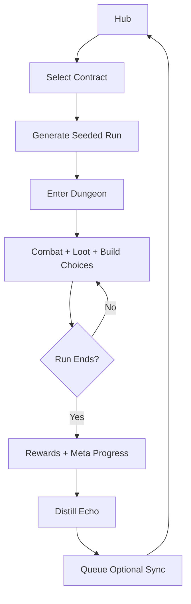

# Project Echo Party

**Echo-Party Roguelite** — an offline-first, mobile-first pixel action RPG built with **Phaser 3 + TypeScript + Capacitor**.

This README is intentionally written for a **GitHub coding agent + human reviewer** workflow.  
It is phased so the project builds in the correct order:

1. **Foundation and game logic first**
2. Deterministic procedural runs
3. Save/offline/mobile packaging
4. Echo async systems
5. Content expansion
6. Premium 3D-feel pixel visuals, VFX, and final asset pipeline

The goal is to avoid the classic failure mode of indie AI game builds:

> pretty-looking slop with no gameplay spine

This project does the opposite.

---

# 1) Product Vision

## Core pitch

Project Echo Party is a **short-session dungeon RPG** where each run is a contract.  
The player clears rooms, fights enemies, makes build choices, and at the end of a run the game **distills their combat style into an Echo**.

That Echo is an asynchronous companion profile that can:

- join future solo runs
- be shared with friends or guildmates later
- create party variety without real-time multiplayer complexity

## Why this concept

This is the best fit because it combines:

- strong replayability
- async social stickiness
- manageable technical scope
- fair monetization
- mobile-friendly sessions
- high compatibility with Phaser 3

## Non-negotiable design principles

- **Offline-first gameplay**
- **No real-time multiplayer in MVP**
- **No loot boxes**
- **No pay-to-win power sales**
- **Deterministic simulation wherever possible**
- **Foundation/logic before presentation polish**
- **No placeholder art passing as final content**

---

# 2) Genre Definition

Project Echo Party is a:

- top-down action roguelite RPG
- mobile-first pixel RPG
- async-social dungeon crawler
- buildcraft-heavy short-session game

## Target session length

- Normal run chunk: **5–8 minutes**
- Individual room encounters: **20–60 seconds**
- Hub management: **1–3 minutes**

---

# 3) Pillars of the Game

## Pillar A — Clean, replayable run loop

Every run must feel:

- readable
- deterministic enough to test
- variable enough to replay
- short enough for mobile
- deep enough to matter

## Pillar B — Echo system

The Echo system is the differentiator.

The game captures **combat preferences**, not raw replays.  
This means Echoes are compact, testable, and resilient.

An Echo should express:

- aggression
- range preference
- movement style
- ability priority
- target priority
- risk tolerance

## Pillar C — Mobile-first clarity

Everything must read on a phone screen:

- enemy silhouettes
- loot drops
- hit VFX
- pathing
- interactables
- UI states

## Pillar D — Premium pixel presentation

The game must feel modern, not cheap retro cosplay.

That means:

- strong visual depth
- readable lighting
- premium loot icons
- weighty combat VFX
- curated palette discipline
- no blurry upscale garbage

---

# 4) What “3D Pixel” Means in This Project

This project does **not** use fully modeled 3D characters as the primary look.

“3D pixel” here means **2D pixel art presented with depth, layering, lighting, shadow logic, and volumetric-feeling VFX**.

## The target look includes

- top-down / slight perspective bias
- layered environment composition
- contact shadows
- depth-separating foreground/background elements
- emissive magic and loot effects
- height cues through offset sprites and projected shadows
- environmental atmospherics like fog, embers, rune glow, dust, rain

## The target look does **not** include

- flat placeholder RPG sprites
- generic AI-generated inventory sludge
- random mismatched tilesets
- mushy icons with no silhouette
- smooth blurry scaling
- “retro because we ran out of budget”

---

# 5) Technical Stack

## Client

- **Phaser 3**
- **TypeScript**
- **Vite**

## Mobile packaging

- **Capacitor**
- Android Studio for Android builds
- Xcode for iOS builds

## Persistence

- IndexedDB via:
  - Dexie **or**
  - idb-keyval

## Offline support

- Service worker
- Workbox `injectManifest`

## Testing

- Vitest for unit/integration
- Playwright for smoke/e2e
- deterministic seed tests in CI

## Optional later backend

- lightweight REST service for Echo upload/pull
- optional future migration to Nakama or similar if needed

---

# 6) Repository Structure

```text
.
├─ apps/
│  ├─ client/                     # Phaser game client
│  └─ server-mock/               # Mock async sync service for Echo exchange
├─ packages/
│  ├─ shared/                    # shared types, schemas, RNG, serialization
│  ├─ sim/                       # deterministic simulation and procgen
│  ├─ content/                   # loot tables, enemy defs, contract defs
│  └─ tooling/                   # atlas scripts, validation scripts
├─ assets/
│  ├─ characters/
│  │  ├─ player/
│  │  ├─ enemies/
│  │  ├─ bosses/
│  │  └─ npc/
│  ├─ icons/
│  │  ├─ materials/
│  │  ├─ consumables/
│  │  ├─ relics/
│  │  ├─ weapons/
│  │  └─ armor/
│  ├─ vfx/
│  │  ├─ combat/
│  │  ├─ elemental/
│  │  ├─ loot/
│  │  └─ ambient/
│  ├─ environment/
│  │  ├─ biomes/
│  │  ├─ props/
│  │  └─ structures/
│  └─ ui/
│     ├─ frames/
│     ├─ buttons/
│     ├─ rarity/
│     └─ skill-icons/
├─ docs/
│  ├─ design/
│  │  ├─ art-bible/
│  │  ├─ asset-briefs/
│  │  ├─ palette-guides/
│  │  └─ vfx-style-guides/
│  ├─ mockups/
│  └─ diagrams/
├─ scripts/
│  ├─ agent/
│  ├─ build/
│  ├─ validation/
│  └─ content/
└─ .github/
   └─ workflows/
```

---

# 7) Runtime Architecture

## Client architecture rule

**Simulation logic must not live inside Phaser Scenes.**

Scenes are adapters for:

- input
- camera
- sprite/state rendering
- audio/VFX triggering
- UI overlays

The actual game rules must live in `packages/sim`.

## Core scenes

- `BootScene`
- `PreloadScene`
- `HubScene`
- `RunScene`
- `UIScene`

## Sim domains

- run state
- combat resolution
- enemy AI
- room generation
- loot generation
- meta progression
- echo distillation
- save serialization

---

# 8) Core Loop



---

# 9) Foundation-First Build Order

This is the most important section in the repository.

The GitHub agent must **not** jump straight into polish.  
The project must be built in the following order.

---

# Phase 1 — Project Bootstrap and Engineering Spine

## Goal

Create a stable repo, toolchain, build system, and coding standards.

## Deliverables

- monorepo scaffold
- Phaser 3 + TypeScript + Vite app
- strict TypeScript enabled
- linting/formatting
- Vitest configured
- Playwright smoke test configured
- GitHub Actions CI
- Capacitor added but minimal
- shared package and sim package created

## Acceptance criteria

- `npm ci` works
- `npm run dev` works
- `npm run build:web` works
- `npm run test` works
- CI passes on PRs

## Human gate

Approve only if the repo is clean and scalable.

---

# Phase 2 — Minimal Playable Core (No Fancy Art)

## Goal

Build the basic playable game loop before any premium visuals.

## Required systems

- player movement
- one combat input model
- health/damage
- enemy spawn
- room completion
- one contract flow
- hub → run → return to hub
- win/lose state
- placeholder-only-for-testing assets clearly marked

## Deliverables

- one hub screen
- one seeded room set
- 2–3 enemy archetypes
- one weapon/ability model
- one drop type
- one reward flow
- one meta-upgrade stub

## Acceptance criteria

A player can:

- start game
- pick contract
- enter run
- kill enemies
- clear at least one room
- receive reward
- return to hub

## Human gate

This is the first real gate.

If the game is not fun at the skeleton level, do not move forward.

---

# Phase 3 — Deterministic Simulation Layer

## Goal

Move all real rules into deterministic sim code.

## Required systems

- seeded RNG
- deterministic room generation
- deterministic loot rolls
- deterministic enemy stats
- deterministic run summaries
- no direct `Math.random()` in gameplay systems

## Deliverables

- `SeededRng`
- room generation module
- combat module
- loot module
- run summary format
- deterministic regression tests

## Acceptance criteria

Given the same seed and inputs:

- room layout is the same
- enemy spawn result is the same
- loot output is the same
- summary hash is stable

## Human gate

Approve only if code is actually separated and testable.

---

# Phase 4 — Save System and Offline-First Stability

## Goal

Make the game reliably playable offline and safe across restarts.

## Required systems

- save slots
- versioned save schema
- migration hooks
- local meta progression persistence
- local run state persistence where appropriate
- service worker shell caching
- offline boot behavior

## Deliverables

- IndexedDB save adapter
- save serializer/deserializer
- version migration test coverage
- Workbox-based service worker
- offline smoke test

## Acceptance criteria

- game boots offline
- save survives restart
- old save schema can migrate
- app shell loads without network

## Human gate

Approve only if data loss risk is low.

---

# Phase 5 — Combat Depth and Run Variety

## Goal

Turn the skeleton into an actual roguelite.

## Required systems

- additional enemy archetypes
- elites
- room modifiers
- relic/build choices
- item rarity structure
- contract modifiers
- progression tuning

## Deliverables

- 6–10 enemy definitions
- 15+ relic/build effects
- 3+ contract modifier families
- 2+ biome rule variants
- reward economy first pass

## Acceptance criteria

Runs feel meaningfully different from each other.

## Human gate

Approve only if replayability is visibly emerging.

---

# Phase 6 — Echo System (Local First)

## Goal

Implement the signature system locally before networking it.

## Echo model

The MVP Echo is **not** a full replay ghost.  
It is a distilled tactical profile.

## Captured traits

- aggression
- movement bias
- keep-distance preference
- target selection strategy
- ability priority list
- survivability bias

## Required systems

- post-run distillation
- Echo profile serialization
- companion AI playback
- local Echo library
- one Echo joining a run

## Deliverables

- `EchoProfileV1`
- distillation pipeline
- companion AI behavior layer
- local equip/select Echo UI

## Acceptance criteria

- player finishes run
- Echo is created
- Echo can join later run
- Echo behavior is meaningfully recognizable

## Human gate

This is a major gate.

If the Echo feels dumb, random, or annoying, fix it here before any backend work.

---

# Phase 7 — Async Sync Mock and Light Social Layer

## Goal

Add optional async exchange without making the game dependent on network.

## Required systems

- upload Echo
- pull Echo
- local sync queue
- conflict-safe fallback
- shared contract/seed codes
- lightweight server mock

## Deliverables

- `server-mock` app
- upload/pull endpoints
- client sync adapter
- retry queue
- disabled-network fallback behavior

## Acceptance criteria

- game still works fully offline
- uploaded Echoes can be fetched later
- no crash if service unavailable

## Human gate

Approve only if offline-first remains intact.

---

# Phase 8 — Content Expansion

## Goal

Add enough content to support real retention testing.

## Required systems

- more contracts
- more enemies
- more relics
- more loot tables
- more rooms
- more biome rules
- better reward curves

## Deliverables

- production-ready content schema
- balancing spreadsheets or JSON balancing data
- rarity tuning
- drop source mapping

## Acceptance criteria

A playtester can play repeatedly without immediate exhaustion.

---

# Phase 9 — Premium Art Direction and Asset Pipeline

## Goal

Only now do we push hard on visuals.

This phase upgrades the game from “playable” to “sellable.”

## Non-negotiable rule

No final art is produced before the game logic foundation is stable.

## Required outputs

- art bible
- palette guide
- asset briefs
- icon standards
- character silhouette standards
- environment standards
- VFX standards
- atlas packing workflow
- in-game readability validation workflow

## Deliverables

- finalized palette families
- loot icon pipeline
- character sprite pipeline
- environment tile standards
- premium UI art standards
- VFX style guide

## Acceptance criteria

The project has a repeatable asset workflow and does not rely on ad hoc slop generation.

## Human gate

Approve only if the art pipeline is coherent and reusable.

---

# Phase 10 — 3D-Feel Pixel VFX and Final Presentation

## Goal

Add volume, impact, and premium atmosphere.

## “3D-feel” implementation methods

- shadow projection
- layered VFX sprites
- emissive overlays
- particle breakup
- height offsets
- ground decals
- camera shake
- atmospheric overlays
- foreground occlusion
- parallax separation

## Required effects

- hit flashes
- weapon trails
- spell charge/cast/impact
- rare loot glow states
- ambient biome effects
- portal/rune effects
- boss telegraphs

## Acceptance criteria

Combat and pickups feel premium, readable, and high-value.

---

# 10) GitHub Agent Operating Rules

## Branch strategy

- `main` = protected stable branch
- `dev` = optional integration branch
- feature branches:
  - `agent/phase-1-bootstrap`
  - `agent/phase-2-core-loop`
  - `agent/phase-3-deterministic-sim`
  - etc.

## PR naming

- `feat: phase 2 playable core loop`
- `feat: phase 6 echo distillation`
- `chore: phase 1 bootstrap repo`
- `refactor: extract sim combat resolver`

## Agent rules

The agent must always:

- make small, reviewable PRs
- keep simulation pure and testable
- write/update tests with gameplay logic
- document assumptions in PR body
- separate temporary assets from production assets
- maintain changelog notes for each phase

The agent must never:

- hide gameplay logic in Scene code
- ship production assets from raw AI output without cleanup
- introduce real-time multiplayer scope into MVP
- merge placeholder art into production atlases
- use non-deterministic randomness in sim code

---

# 11) CI/CD

## PR CI

Every PR must run:

- lint
- typecheck
- unit tests
- deterministic tests
- web build
- e2e smoke

## Nightly CI

Nightly pipeline should run:

- extended determinism checks
- content validation
- atlas validation
- Android debug build

## Release candidate pipeline

On tag or release branch:

- build web bundle
- generate service worker
- sync Capacitor
- produce Android artifact
- optionally produce iOS project artifact for manual signing

---

# 12) Testing Strategy

## Unit tests

Test:

- RNG behavior
- procgen determinism
- combat math
- loot resolution
- Echo distillation
- save migration

## Integration tests

Test:

- hub to run transition
- reward persistence
- local Echo equip/use
- sync queue logic

## E2E tests

Minimum smoke coverage:

- app boots
- contract starts
- one room can be cleared
- reward is granted
- save persists
- app reload restores state

---

# 13) Asset Quality Standard

This section exists so the agent understands that “assets” are not random filler.

## Asset classes

- characters
- loot icons
- environment
- VFX
- UI art

## Character standards

- readable silhouette
- consistent light source
- clear combat role
- animation weight
- no blurred upscale
- no mismatched style batches

## Loot icon standards

- readable at small mobile sizes
- one dominant form
- strong material language
- clear value separation
- rarity readable without turning into glow soup

## Environment standards

- tiles tile cleanly
- props imply depth
- shadows are intentional
- biome palette is controlled
- architecture feels layered, not sticker-like

## VFX standards

- enhance readability, do not obscure it
- use layered effects instead of spam
- elemental identity is immediately visible
- performance must hold on mobile

---

# 14) Art Pipeline: AI-Assisted, Human-Directed

## Rule

AI may create **drafts**, not final truth.

## Required asset workflow

1. Write asset brief
2. Generate concept batch
3. Select strongest silhouette/material direction
4. Cleanup pass
5. Palette correction
6. In-game readability test
7. Final atlas integration

## Asset brief must include

- gameplay function
- category
- target size
- silhouette goal
- palette family
- material language
- rarity
- biome/faction alignment

---

# 15) Exact Standards for Loot Icons, Characters, and 3D-Feel VFX

## Loot icons

Target size:

- 32x32 or 48x48

Requirements:

- readable on inventory screen
- readable when dropped in world
- material identity first
- strong center silhouette
- no muddy edge detail

Examples:

- iron shard = cool highlight, angular, metallic edge
- slime gel = rounded, glossy, wet
- temple ash = dusty, brittle, low saturation
- copper fragment = warm chipped metal, oxidation hints
- arcane sigil = luminous geometry, controlled glow

## Character sprites

Recommended sizes:

- player / standard enemies: 24x24 or 32x32
- elites / bosses: 48x48 to 96x96 depending on role

Required animation set:

- idle
- walk
- attack
- hit
- cast if relevant
- death

## 3D-feel VFX stack

A major effect may combine:

- base sprite
- additive glow
- particles
- impact decal
- projected shadow
- height offset
- camera shake
- palette pulse
- ambient lingering frame

Examples:

### Fireball impact

- core projectile
- hot bloom
- ember burst
- scorch decal
- micro shake
- heat shimmer

### Rare loot drop

- item sprite
- rarity halo
- sparkle particles
- bob animation
- contact shadow
- optional rune ring

### Arcane slash

- slash trail
- echo trail
- spark breakup
- hit flash
- ground contact line

---

# 16) Placeholder Policy

Temporary placeholders are allowed only for engineering speed.

They must:

- live in `_prototype` or `_placeholder` folders
- include `_placeholder` in filename
- never be merged into production atlases
- have replacement issues logged

---

# 17) Setup

## Requirements

- Node.js LTS
- npm
- Android Studio
- Xcode for iOS work
- Java 17+

## Install

```bash
git clone <repo>
cd <repo>
npm ci
```

## Run web dev

```bash
npm run dev
```

## Test

```bash
npm run test
npm run test:e2e
```

## Build web

```bash
npm run build:web
```

## Sync Capacitor

```bash
npm run cap:sync
```

## Run Android

```bash
npm run cap:run:android
```

## Run iOS

```bash
npm run cap:run:ios
```

---

# 18) Suggested Starter Files

## Core packages

- `packages/shared/src/rng.ts`
- `packages/shared/src/types.ts`
- `packages/shared/src/echo.ts`
- `packages/sim/src/world.ts`
- `packages/sim/src/combat/`
- `packages/sim/src/procgen/`
- `packages/sim/src/loot/`
- `packages/sim/src/meta/`

## Client

- `apps/client/src/main.ts`
- `apps/client/src/scenes/BootScene.ts`
- `apps/client/src/scenes/PreloadScene.ts`
- `apps/client/src/scenes/HubScene.ts`
- `apps/client/src/scenes/RunScene.ts`
- `apps/client/src/scenes/UIScene.ts`

## Docs

- `docs/design/art-bible/README.md`
- `docs/design/asset-briefs/`
- `docs/design/palette-guides/`
- `docs/design/vfx-style-guides/`

---

# 19) Monetization

## Allowed

- cosmetics
- UI themes
- skins
- battle-pass-like comfort features
- expansion content

## Forbidden

- power sold for money
- loot boxes
- gacha
- energy timers that choke play

---

# 20) Success Criteria

The project succeeds when:

- the game is fun before polish
- runs are meaningfully replayable
- Echoes feel distinct and useful
- mobile performance is stable
- offline mode is trustworthy
- screenshots look premium
- loot feels exciting before the stat box is opened
- nobody says “this is AI placeholder hell”

---

# 21) Roadmap Summary

| Phase | Name              | Status Goal                    |
| ----- | ----------------- | ------------------------------ |
| 1     | Bootstrap         | Repo + CI stable               |
| 2     | Minimal Core      | Playable dungeon loop          |
| 3     | Deterministic Sim | Testable procgen/combat        |
| 4     | Save + Offline    | Stable persistence             |
| 5     | Run Variety       | True roguelite replayability   |
| 6     | Echo Local        | Signature feature works        |
| 7     | Async Sync        | Optional social layer          |
| 8     | Content Expansion | Retention-ready breadth        |
| 9     | Art Pipeline      | Production-safe asset workflow |
| 10    | 3D Pixel VFX      | Premium presentation           |

---

# 22) Final Rule

If forced to choose between:

- more visual polish
- or stronger game logic

choose **stronger game logic** first.

A beautiful corpse is still a corpse.
A clean combat loop can survive ugly temp art.
The reverse is not true.
